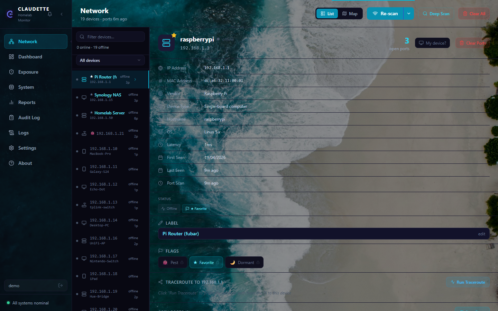
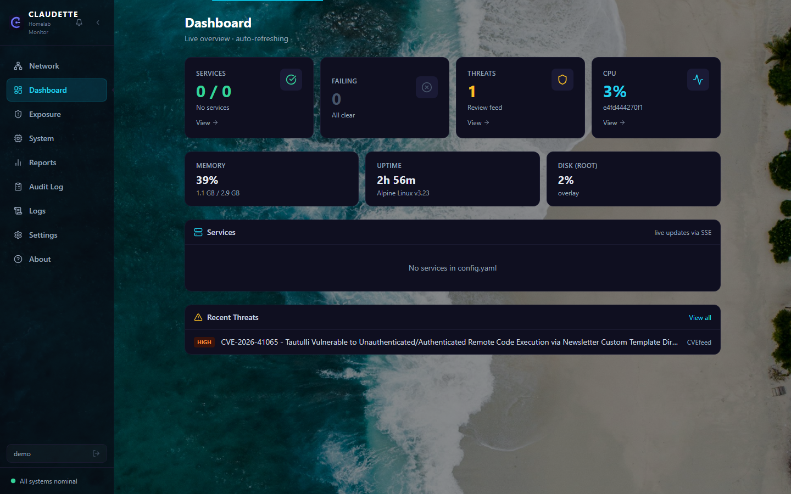
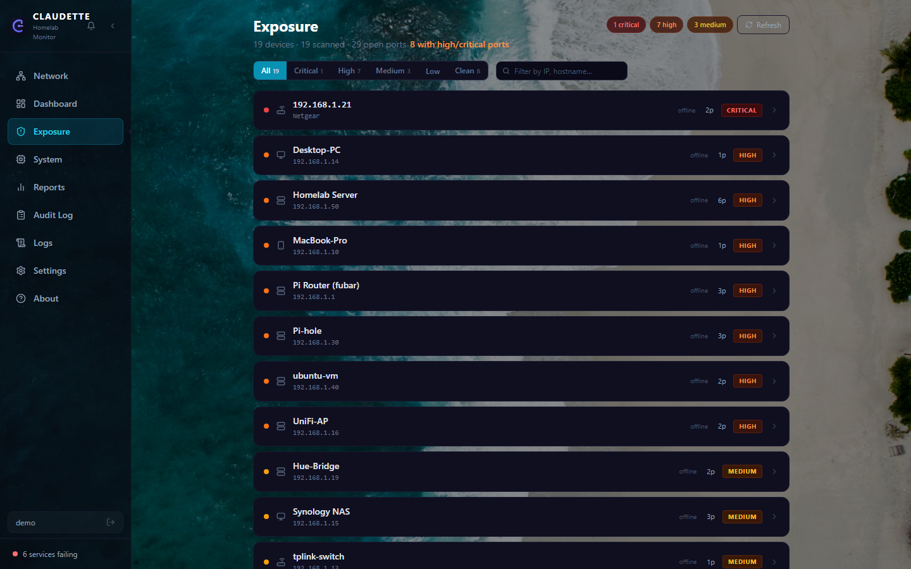
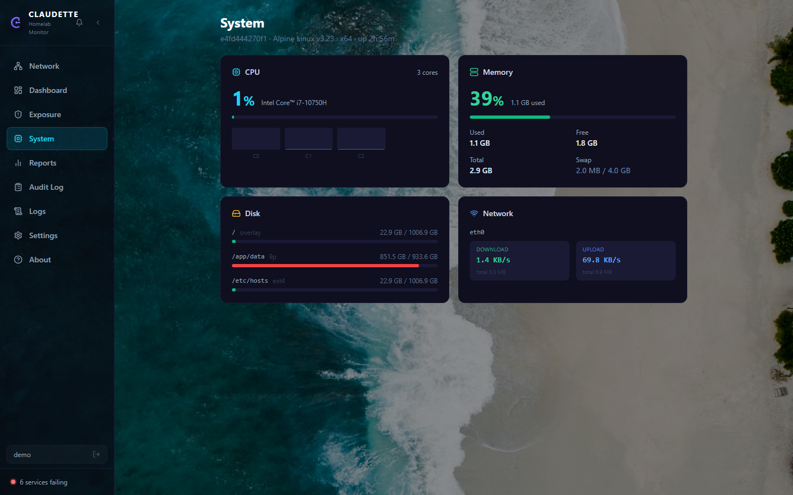
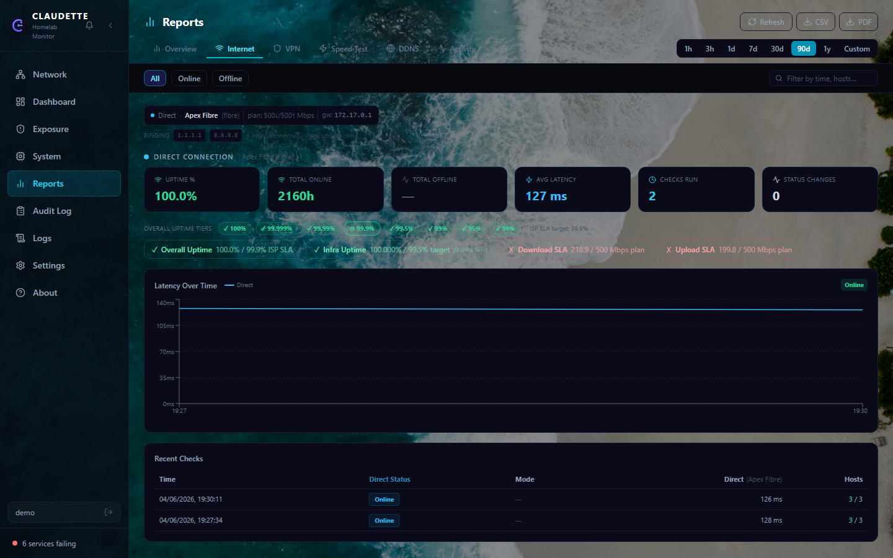
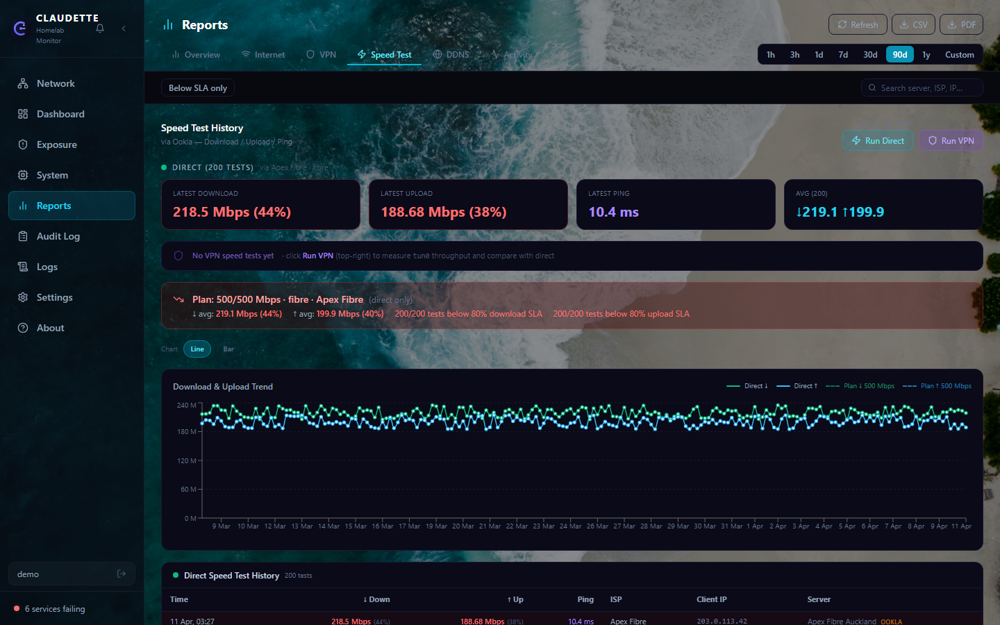
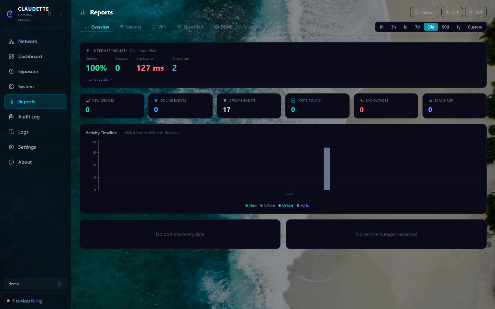
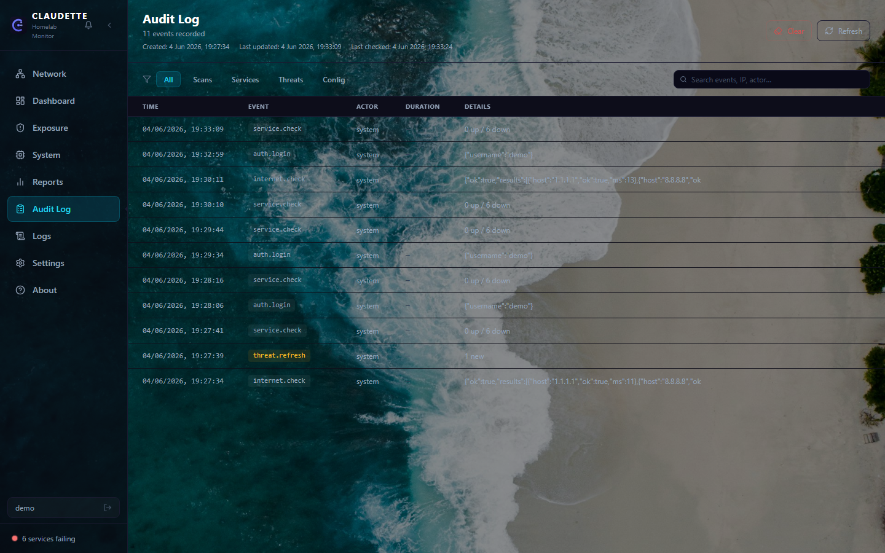
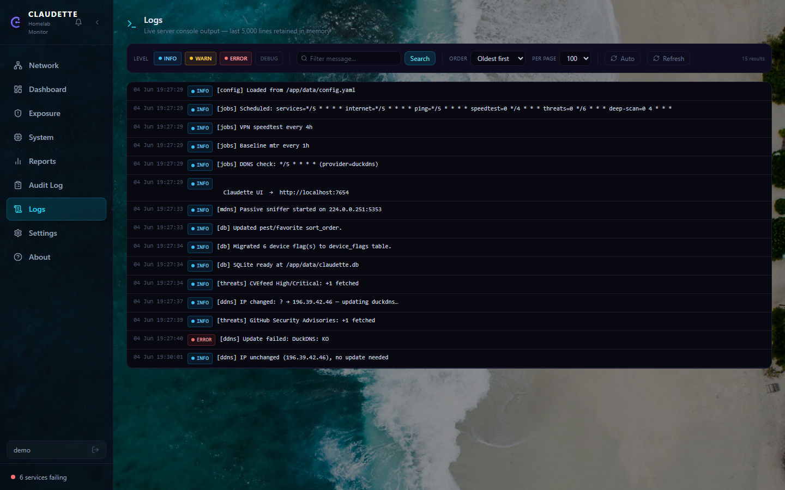
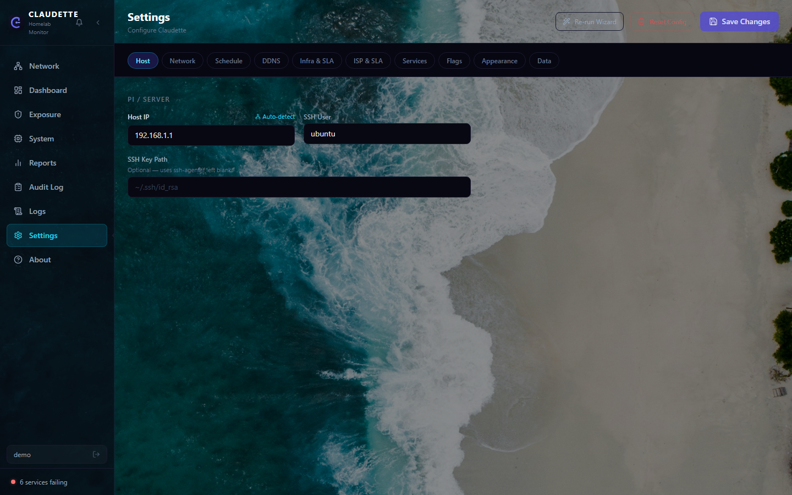

# Claudette

A self-hosted home network monitoring dashboard. Runs in Docker on a Raspberry Pi (or any Linux host) and gives you a live view of every device on your network, monitored services, internet health, speed history, CVE threat intelligence, and a full audit trail — all from a browser or Kodi.

---

## Features

| Area | What it does |
|---|---|
| **Network scan** | nmap ping-sweep discovers every device on your LAN. Shows IP, hostname, MAC, vendor, OS, open ports, latency, traceroute. |
| **Deep scan** | Sequential port scan of all devices — runs nightly at 4 am or on demand. |
| **Services** | HTTP/Docker health checks on a configurable schedule. Tracks uptime history. |
| **Threats** | CVE feed filtered to your keywords (e.g. `nginx`, `docker`, `python flask`). |
| **Internet / outage** | Pings configurable hosts every N minutes. Pairs outages, calculates downtime, generates ISP SLA reports. |
| **Speed test** | Scheduled download/upload/ping tests. Exportable to PDF or CSV. |
| **System stats** | CPU, memory, disk, network usage of the host running Claudette. |
| **Audit log** | Every scan, device change, and user action timestamped to the second. |
| **Backup / restore** | Download a `.claudette.gz` bundle (gzip-compressed config + SQLite db). Auto-backup every N days with configurable retention. |
| **Reports** | PDF and CSV exports for outages, speed history, device inventory. Persistent filter bars on every tab. |
| **Auth** | Single-user login with bcrypt passwords and JWT session cookies. |
| **Kodi addon** | Optional Python addon for LibreELEC / Kodi — browse the dashboard from your TV. |

---

## Screenshots

### Network — device list with detail panel


### Dashboard — live status overview


### Exposure — open port risk assessment


### System — host hardware stats


### Reports — internet outage history


### Reports — speed test history


### Reports — overview


### Audit log — full event history


### Logs — live server console


### Settings — configuration editor


---

## Requirements

### Running locally

| Tool | Notes |
|---|---|
| **Docker Desktop** (Windows / macOS) or **Docker Engine** (Linux) | Required to build and run the app. |
| nmap | Installed *inside* the Docker image — not needed on your workstation. |

### Deploying to a Raspberry Pi

| Requirement | Notes |
|---|---|
| **Raspberry Pi OS or Ubuntu** | 64-bit (arm64). Pi 4 (2 GB+) recommended; Pi 3B+ works. |
| **Docker on the Pi** | Must be installed on the Pi before the first deploy — see [Pi setup](#pi-setup) below. |
| **OpenSSH client** | Built into Windows 10+, macOS, and all Linux distros. Used for SSH and SCP transfers. |
| **Key-based SSH auth** | Required — the deploy scripts use `BatchMode=yes` and will not prompt for a password. |
| **Docker Buildx** *(Linux / macOS → Pi only)* | Included with Docker Desktop; on standalone Docker Engine: `docker buildx version`. Used for ARM64 cross-compilation. *Not required from Windows* — the Windows script builds natively on the Pi. |

### Local development

| Tool | Notes |
|---|---|
| Node.js 20+ | Only needed for working on the source code. `node --version` to check. |

The app runs well on a Raspberry Pi 4 (2 GB+) or any x86-64 Linux host.

---

## Quick start — Docker (local machine)

```bash
# 1. Copy and edit the example config
cp config.example.yaml config.yaml   # Linux / macOS
# Windows: copy config.example.yaml config.yaml
# Edit config.yaml with your subnet, services, ISP details, etc.

# 2. Build and run
.\scripts\windows\deploy-win.ps1     # Windows
./scripts/linux/restart.sh           # Linux / macOS

# 3. Open in browser
http://localhost:7654
```

On first launch the setup wizard runs — create an admin account and confirm your config.

> **Windows note:** Docker Desktop on Windows runs containers inside a WSL2 VM,
> which means two things behave differently from a native Linux install:
> - **Speedtest results** will read roughly 40–60% of your actual line speed due to VM networking overhead.
> - **Device vendor/hostname info** from nmap is limited — ARP scanning only reaches the VM's virtual NIC, not your physical LAN.
>
> Neither of these affect internet connectivity monitoring, outage detection, or service health checks — those all work fully. For accurate speed and device data, running on a Raspberry Pi or Linux machine is recommended.

---

## Deploy to a Raspberry Pi

The recommended setup is to run Claudette on a Pi that stays on 24/7.

### Pi setup

Before running any deploy script for the first time, your Pi needs Docker installed and SSH key access configured.

**1. Install Docker on the Pi**

SSH into the Pi and run one of the following:

```bash
# Option A — official Docker install script (recommended)
curl -fsSL https://get.docker.com | sudo sh

# Option B — via apt
sudo apt update && sudo apt install -y docker.io
```

Add your user to the `docker` group so the deploy scripts can run `docker` without a full sudo password:

```bash
sudo usermod -aG docker $USER
# Log out and back in for the group change to take effect
docker run --rm hello-world   # verify it works
```

**2. Set up SSH key access**

The deploy scripts use `BatchMode=yes` — they will not stop to prompt for a password. Key-based authentication is required.

```bash
# Generate a key on your workstation if you don't have one
ssh-keygen -t ed25519 -C "claudette-deploy"

# Copy the public key to the Pi
ssh-copy-id ubuntu@<pi-ip>                          # Linux / macOS / WSL

# Windows PowerShell alternative (no ssh-copy-id):
# Get-Content ~/.ssh/id_ed25519.pub | ssh ubuntu@<pi-ip> "mkdir -p ~/.ssh && cat >> ~/.ssh/authorized_keys"
```

Test it — this should print `ok` with no password prompt:

```bash
ssh ubuntu@<pi-ip> echo ok
```

**3. Configure `config.yaml`**

The deploy scripts read the Pi address and SSH user automatically from `config.yaml`:

```yaml
pi:
  host: 192.168.1.10          # Your Pi's IP address
  ssh_user: ubuntu            # SSH username (default on Pi OS / Ubuntu)
  # ssh_key: ~/.ssh/id_ed25519  # Optional — omit to use ssh-agent
```

---

### Windows → Pi

```powershell
# Full deploy — packages source, uploads to Pi, builds image natively on Pi, restarts container
.\scripts\windows\deploy-pi.ps1

# Server-only update — skip Docker rebuild, sync only server/ files into running container (~5 s)
.\scripts\windows\deploy-pi.ps1 -Quick

# Skip the Docker build — just restart the container using the image already on the Pi
.\scripts\windows\deploy-pi.ps1 -SkipBuild

# Override the Pi address for a one-off deploy
.\scripts\windows\deploy-pi.ps1 -PiHost 192.168.1.50
```

**What the full deploy does:**

1. Packages the project source (frontend + backend + Dockerfile) into a tarball on your workstation
2. Uploads the tarball to the Pi via SCP
3. SSHs into the Pi and runs `docker build` natively — the Pi builds its own ARM64 image directly, no cross-compilation
4. Stops the old container and starts a fresh one with `--network host`, `--restart unless-stopped`, and the correct Linux capabilities

> **Requirements on your workstation:** OpenSSH client and `scp` — both built into Windows 10 and later. Docker Desktop is *not* required for a full Pi deploy.

---

### Linux / macOS → Pi

```bash
chmod +x scripts/linux/deploy-pi.sh   # one-time

# Full build + deploy
./scripts/linux/deploy-pi.sh

# Skip the Docker build (reuse last image tarball)
./scripts/linux/deploy-pi.sh --skip-build

# Override the Pi address
./scripts/linux/deploy-pi.sh --host 192.168.1.50
```

**What it does:**

1. Cross-compiles a `linux/arm64` Docker image on your machine via `docker buildx`
2. Saves the image as a tarball and copies it to the Pi over SCP
3. Loads the image on the Pi and restarts the container

> **Requirements on your workstation:** Docker with Buildx (included in Docker Desktop; on standalone Engine: `docker buildx version`), OpenSSH client, `scp`.

---

The container always runs with `--network host` so nmap can reach every device on your LAN. Persistent data (SQLite database and backups) lives in the Docker volume `claudette-data`, mounted at `/app/data` inside the container — it survives container restarts and image updates.

### SSH config tip

Add this to `~/.ssh/config` on your workstation to avoid repeating the Pi address:

```
Host pi
  HostName 192.168.1.10
  User ubuntu
  IdentityFile ~/.ssh/id_ed25519
```

Then use `-PiHost pi` (Windows) or `--host pi` (Linux/macOS) when calling the deploy scripts.

---

## Configuration

Copy `config.example.yaml` to `config.yaml` and edit it. The file is excluded from Git — never commit your real config.

```yaml
pi:
  host: 192.168.1.10        # IP of your Pi / server
  ssh_user: ubuntu

network:
  subnet: 192.168.1.0/24    # Subnet to scan
  # Multiple subnets:
  # subnets:
  #   - 192.168.1.0/24
  #   - 192.168.68.0/24
  connectivity_hosts:
    - 1.1.1.1               # Hosts to ping for internet health checks
    - 9.9.9.9

schedule:
  check_interval_minutes: 5     # Service health check frequency
  internet_check_minutes: 5     # Internet connectivity check frequency
  ping_interval_minutes: 5      # Lightweight device ping-sweep frequency
  speedtest_interval_hours: 1   # Speed test frequency
  threat_interval_hours: 6      # CVE feed refresh frequency
  deep_scan_hour: 4             # Hour (0–23) for the nightly full port scan
  backup_interval_days: 7       # Auto-backup frequency (0 = disabled)
  backup_keep_days: 7           # How many days to keep auto-backups

isp:
  name: MyISP
  connection_type: fibre        # fibre / dsl / lte / cable / satellite
  expected_uptime: 100          # % for SLA reports
  plan_download_mbps: 250
  plan_upload_mbps: 250
  sla_url: ""                   # URL to ISP SLA document
  sla_notes: ""                 # Free-text SLA notes

infra:
  name: ""                      # Local device name (router, firewall, etc.)
  connection_type: router       # router / firewall / switch / wireless-ap / vpn / server / other
  sla_pct: 0                    # Infra uptime target % (0 = disabled)
  plan_download_mbps: 0
  plan_upload_mbps: 0
  sla_url: ""                   # URL to SLA or warranty document
  sla_notes: ""

threats:
  keywords:                     # CVEs matching these keywords will be shown
    - docker
    - python
    - nginx
  severity_threshold: medium    # low / medium / high / critical
```

### Monitored services

Services are configured through the UI (Settings → Services) or directly in the database. Each service has:

| Field | Description |
|---|---|
| `name` | Display name |
| `url` | HTTP URL to check (e.g. `http://192.168.1.10:8080`) |
| `type` | `http` (default) or `docker` |
| `expected_status` | Expected HTTP status code (default `200`) |

---

## Data & backups

All data lives in a SQLite database at `/app/data/state.db` inside the container. The Docker volume `claudette-data` persists this across container restarts.

**Manual backup**: Settings → Backup & Restore → *Backup Now* — downloads a `.claudette.gz` file (gzip-compressed JSON bundle containing the config YAML and base64-encoded SQLite binary; typically 85–90% smaller than the raw data).

**Restore**: Settings → Backup & Restore → *Restore from File* — upload a `.claudette.gz` file. The server validates and replaces the database and config, then restarts cleanly.

**Auto-backup**: set `backup_interval_days` in config (0 = disabled). Backups are saved to `/app/data/backups/` as `.claudette.gz` files. Set `backup_keep_days` to control how long they are kept (default 7 days).

---

## Kodi addon

An optional addon is available for LibreELEC / Kodi. Find it in `output/kodi/plugin.program.claudette/`.

See [`output/kodi/plugin.program.claudette/README.txt`](output/kodi/plugin.program.claudette/README.txt) for install instructions.

Build a distributable zip:

```powershell
# Windows
.\output\kodi\build-addon.ps1

# Then deploy to a Kodi host
.\output\kodi\deploy-addon.ps1 -KodiHost 192.168.1.20
```

---

## Development

```bash
# Install dependencies
npm install

# Start dev server (hot-reload frontend + Node backend)
npm run dev

# Run tests
npm test

# Build production assets
npm run build
```

### Stack

| Layer | Technology |
|---|---|
| Frontend | React 18, Vite 5, Tailwind CSS, Recharts, Lucide icons |
| Backend | Node.js 20, Express 4, ESM modules |
| Database | SQLite via `node-sqlite3-wasm` (no native bindings — works on any arch) |
| Auth | bcryptjs passwords, JWT session cookies, rate-limited login |
| Container | Docker, multi-stage build (`linux/amd64` locally; `linux/arm64` on Pi natively or via buildx) |

### Project structure

```
├── server/               Node.js backend
│   ├── index.js          App entry point, cron jobs, SSE broadcast
│   ├── db.js             SQLite helpers
│   ├── config.js         YAML config loader
│   ├── middleware/
│   │   └── auth.js       JWT auth middleware
│   ├── utils/
│   │   └── schedule.js   Cron expression helpers (minutesToCron / hoursToCron)
│   └── routes/
│       ├── network.js    nmap scanning, mDNS, ARP, port scanning
│       ├── services.js   HTTP / Docker health checks
│       ├── threats.js    CVE / NVD threat feed
│       ├── system.js     Stats, backup, restore
│       ├── reports.js    Outage + speed report queries
│       ├── audit.js      Audit log queries
│       ├── config.js     Config read/write API
│       └── auth.js       Login, logout, register
├── src/                  React frontend
│   ├── App.jsx           Root component, SSE listener, global state
│   ├── components/       Page components (Dashboard, NetworkScan, etc.)
│   └── lib/
│       ├── api.js        Fetch wrappers + SSE helper
│       ├── themes.js     Theme definitions
│       └── threatMatch.js CVE keyword matching
├── tests/                Vitest test suite
│   ├── server/           Server-side unit tests
│   └── lib/              Frontend utility tests
├── output/kodi/          Kodi addon source + build scripts
├── scripts/
│   ├── windows/          PowerShell deploy scripts
│   └── linux/            Bash deploy scripts
├── Dockerfile            Multi-stage Docker build
├── config.example.yaml   Config template (commit this, not config.yaml)
└── scripts/windows/      PowerShell deploy scripts (see scripts/README.md)
```

### Tests

```bash
npm test
```

Tests live in `tests/` and are run with Vitest. Coverage includes auth middleware, config sanitisation, IP utilities, outage pairing, report helpers, threat matching, and theme utilities.

---

## Security notes

- **No cloud dependency** — everything runs on your own hardware
- Passwords are hashed with bcrypt (cost factor 12)
- JWTs are `httpOnly` + `sameSite: strict` cookies — not accessible from JavaScript
- Login is rate-limited (20 attempts / 15 min per IP)
- All API routes except `/auth/*` require a valid session
- `config.yaml` is excluded from Git — never contains committed secrets
- The container uses `--network host` which is required for raw socket scanning; do not expose port 7654 to the internet

---

## License

MIT — see [LICENSE](LICENSE) for details.
